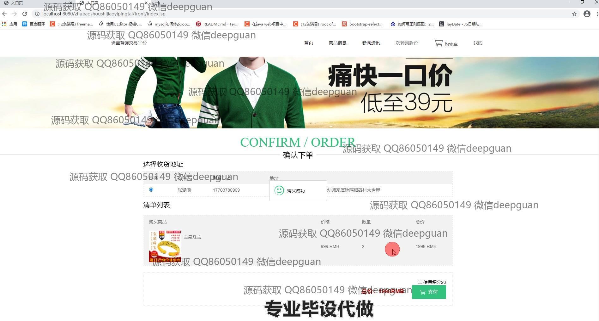

<h1 align="center">珠宝首饰交易平台开发</h1>

## 简介
珠宝首饰交易平台：角色分为管理员、用户；功能包括用户管理、商品分类管理、商品信息管理、订单管理、个人中心、充值与支付功能。    --计算机毕业设计源码；毕设源码；java毕业设计源码

## 联系方式

<h3 align="center">获取完整代码与数据库文件 + 微信：deepguan QQ: 86050149 QQ群: 783742310</h3>

<h3 align="center">可帮忙远程部署 包运行成功！提供远程部署、修改代码、设计文档指导、代码讲解等服务！</h3>

## 功能介绍（完整见运行截图）
管理员：管理员可以访问平台的后台管理功能模块，包括用户管理、商品类别管理、商品信息管理、系统管理和订单管理。在用户管理界面，管理员可以查看、修改和删除用户信息。在商品信息管理中，管理员可以添加和管理商品分类及商品具体信息，并更新商品状态。系统管理中可以上传轮播图片。订单管理界面提供了查看订单详情、处理订单以及删除订单的功能。

用户：用户可以在交易平台上进行个人信息管理、商品购买和订单处理。个人中心允许用户查看和修改个人信息、订单、地址和收藏；同时可查看账户余额和积分。商品页面提供商品信息浏览和搜索、添加至购物车以及结算和支付功能。订单确认页面中，用户可以选择收货地址和支付方式进行最终购买确认。充值界面支持多种支付方式，便于用户操作。

## 运行截图

本代码来源于网络,仅供学习参考使用!

